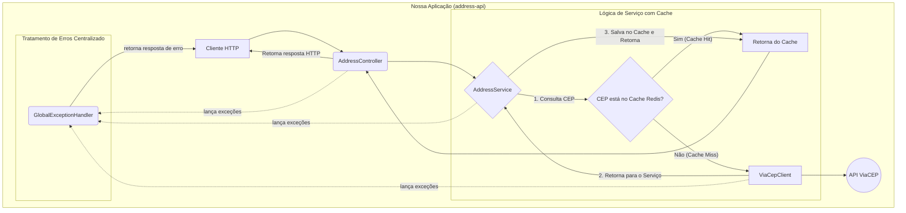

# Case Técnico Itaú - API de Consulta de Endereços


## Visão Geral

Esta é uma API REST desenvolvida como solução para o case técnico "Distribuição Rede de Agências". O projeto consiste em uma fachada inteligente para a API pública ViaCEP, com o objetivo de consultar, tratar e retornar dados de endereço de forma simplificada, resiliente e performática para um gerente consultivo.

A arquitetura utilizada foi o **MVC**: uma arquitetura limpa e conhecida, código de alta qualidade, e um foco especial em diferenciais técnicos como tratamento de erros robusto, cache de performance e uma estratégia de testes, demonstrando uma linha de pensamento orientada à qualidade e manutenibilidade.

## Arquitetura da Solução

### O Porquê da Escolha: MVC + Camada de Serviço

A solução foi projetada utilizando o padrão arquitetural **MVC (Model-View-Controller)**, complementado por uma **Camada de Serviço**, conforme sugerido pelo case.

A escolha foi deliberada para manter a simplicidade e clareza, alinhada às melhores práticas de mercado para APIs REST com Spring Boot. Em vez de padrões mais complexos que adicionariam sobrecarga desnecessária para o escopo do problema, optou-se por uma arquitetura que favorece:
* **Separação de Responsabilidades:** Cada camada tem um papel claro (o Controller lida com HTTP, o Service com a lógica de negócio, e o Client com a comunicação externa).
* **Manutenibilidade:** A estrutura organizada torna o código fácil de entender, modificar e estender.
* **Testabilidade:** Isolar a lógica de negócio na camada de serviço simplifica drasticamente a implementação de testes unitários.

### Diagrama de Fluxo (Mermaid)

O diagrama abaixo ilustra o fluxo de uma requisição através das camadas da aplicação, incluindo os diferenciais de cache e tratamento de erros.



## Requisitos Atendidos

### Requisitos Funcionais (RF)
-   **RF01:** A aplicação expõe um endpoint `GET /addresses/{cep}` para consulta de endereço.
-   **RF02:** Na resposta ao usuário, os campos `IBGE`, `GIA`, `DDD`, `Siafi` e `UF` são removidos.
-   **RF03:** O campo `logradouro` na resposta é convertido para letras minúsculas (`lowercase`).
-   **RF04:** A aplicação valida o formato do CEP. Se inválido, deve retornar um erro **400 Bad Request**.
-   **RF05:** Se o CEP não for encontrado na ViaCEP, a aplicação deve retornar um erro **404 Not Found**.
-   **RF06:** Se a comunicação com a ViaCEP falhar por indisponibilidade (timeout), a aplicação deve retornar um erro **503 Service Unavailable**.

### Requisitos Não Funcionais (RNF)
-   **RNF01:** A solução utiliza o padrão arquitetural MVC.
-   **RNF02:** O código segue boas práticas, com nomes claros e sem comentários desnecessários.
-   **RNF03:** Testes **unitários** e de **integração** foram implementados para garantir a qualidade.
-   **RNF04:** O código-fonte está versionado em um repositório público.
-   **RNF05:** Este `README.md` fornece instruções claras de execução e documentação da solução.
-   **RNF06:** A aplicação implementa um mecanismo de cache com Redis para otimizar performance e resiliência.

## Diferenciais Técnicos

Para ir além do solicitado, foram implementados os seguintes diferenciais:

1.  **Tratamento Robusto de Erros:** A API não quebra com entradas inesperadas ou falhas externas. Ela retorna códigos de erro HTTP padronizados e mensagens claras para cada cenário (CEP inválido, não encontrado, serviço externo indisponível), utilizando um `GlobalExceptionHandler` (`@ControllerAdvice`) para centralizar essa lógica.

2.  **Cache de Performance e Resiliência com Redis:** Para otimizar requisições repetidas e tornar a API mais resiliente a falhas do ViaCEP, foi implementada uma camada de cache. Respostas bem-sucedidas são armazenadas no Redis por 24 horas. Isso resulta em tempos de resposta drasticamente menores para consultas subsequentes e mantém a API parcialmente funcional mesmo se o serviço externo estiver fora do ar.

3.  **Estratégia de Testes Completa:** Foram criados dois níveis de testes automatizados:
    * **Testes Unitários:** Focados na `AddressService` para validar a lógica de negócio de forma isolada e rápida.
    * **Testes de Integração:** Focados no `AddressController` para validar o comportamento da API de ponta a ponta (endpoints, validações de entrada, status HTTP e contratos JSON).

## Tecnologias Utilizadas

-   **Java 21**
-   **Spring Boot 3.5.x** (com Spring Web e Spring Data Redis)
-   **Redis** (Cache distribuído)
-   **Apache Maven** (Gerenciador de dependências)
-   **JUnit 5 & Mockito** (Para testes)
-   **Docker** (Para ambiente de desenvolvimento com Redis)

## Como Executar

### Pré-requisitos
-   Java (JDK) 21 ou superior.
-   Apache Maven 3.8 ou superior.
-   **Docker Desktop** (para executar o Redis localmente).

### Passos

1.  **Inicie o contêiner do Redis:**
    Antes de rodar a aplicação, a instância do Redis precisa estar disponível. O Docker automatiza isso. Abra um terminal e execute:
    ```bash
    docker run -d --name redis-cache -p 6379:6379 redis:latest
    ```

2.  **Clone o repositório:**
    ```bash
    git clone https://github.com/KawanMark/case-address-api.git
    ```

3.  **Execute a aplicação:**
    Navegue até a pasta raiz do projeto e use o Maven Wrapper para iniciar o servidor.
    * No Windows:
    ```bash
    .\mvnw spring-boot:run
    ```
    * No Linux/macOS:
    ```bash
    ./mvnw spring-boot:run
    ```
4.  A API estará disponível em `http://localhost:8080`.

## Documentação da API

### `GET /addresses/{cep}`
Busca um endereço pelo CEP. O CEP pode ser informado com ou sem formatação (hífen).

#### Resposta de Sucesso (Status 200 OK)
-   **Condição:** O CEP é válido e encontrado.
-   **Exemplo:** `curl -X GET http://localhost:8080/addresses/01001000`
-   **Retorno:**
```json
{
    "cep": "01001-000",
    "logradouro": "praça da sé",
    "complemento": "lado ímpar",
    "bairro": "Sé",
    "localidade": "São Paulo"
}
```

#### Respostas de Erro

* **CEP com formato inválido (Status 400 Bad Request)**
    -   **Condição:** O CEP informado não contém 8 dígitos numéricos.
    -   **Exemplo:** `curl -i -X GET http://localhost:8080/addresses/123`
    -   **Retorno:**
    ```json
    {
        "error": "Formato de CEP inválido. O CEP deve conter 8 dígitos numéricos."
    }
    ```

* **CEP não encontrado (Status 404 Not Found)**
    -   **Condição:** O CEP é válido, mas não corresponde a nenhum endereço.
    -   **Exemplo:** `curl -i -X GET http://localhost:8080/addresses/99999999`
    -   **Retorno:**
    ```json
    {
        "error": "CEP não encontrado."
    }
    ```

* **Serviço indisponível (Status 503 Service Unavailable)**
    -   **Condição:** A API do ViaCEP está fora do ar ou excede o timeout de 5 segundos.
    -   **Retorno:**
    ```json
    {
        "error": "O serviço externo (ViaCEP) está indisponível."
    }
    ```

## Como Rodar os Testes
Para executar a suíte completa de testes unitários e de integração, navegue até a raiz do projeto e execute:
```bash
./mvnw test
```
